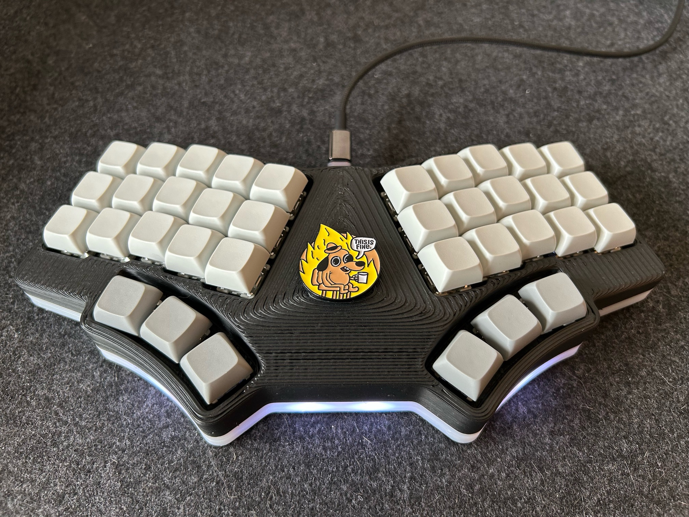
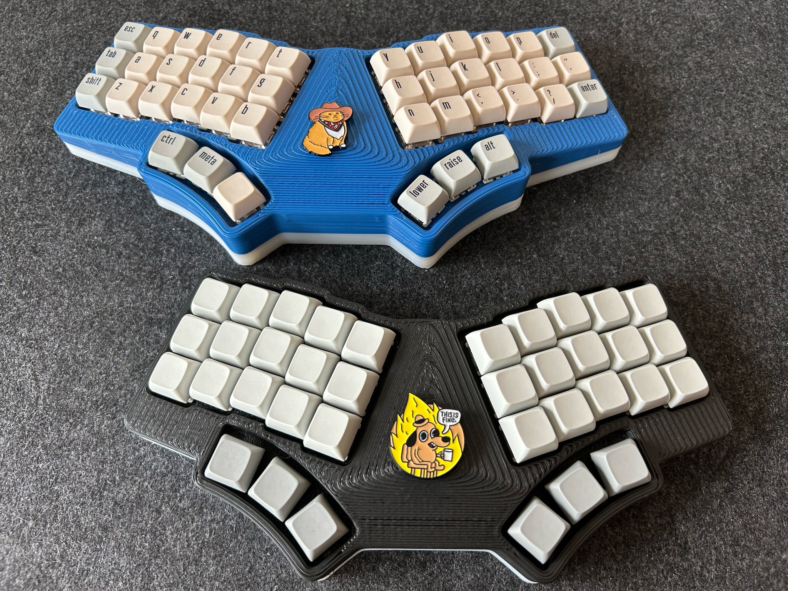
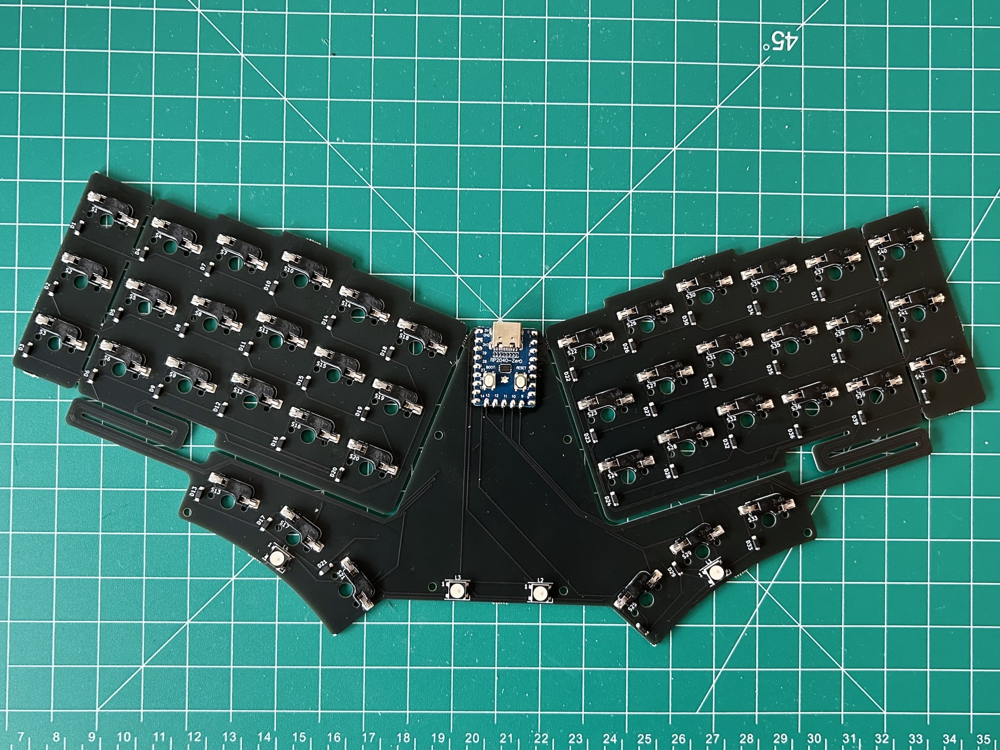
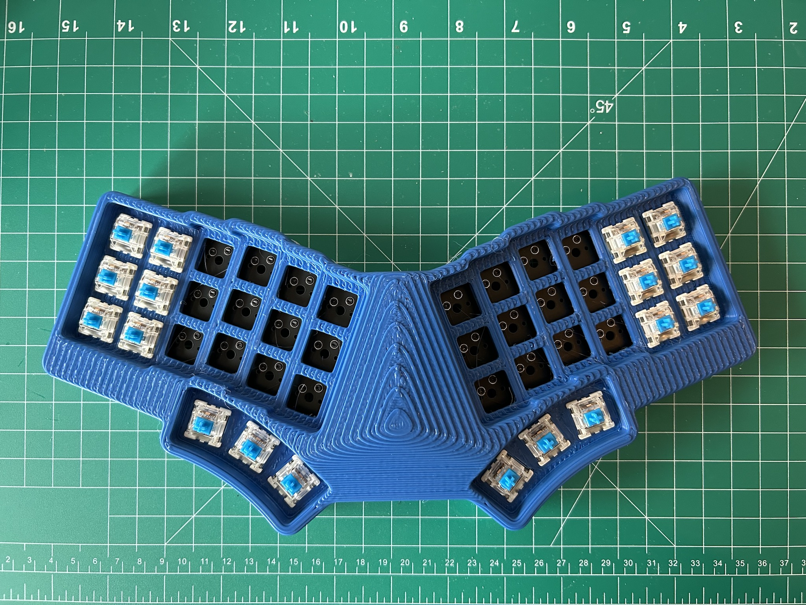
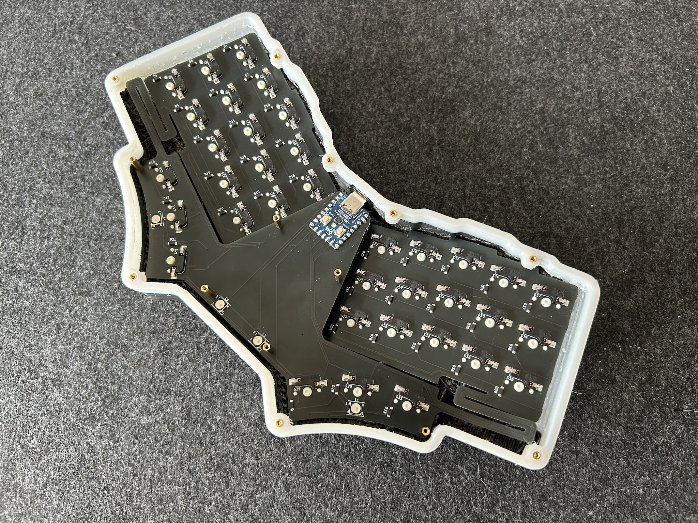

## WeirdFlexButOk - MX version

A hot-swappable, ergo monoblock split keyboard with tenting.

Similar to the [Choc version](https://github.com/penk/WeirdFlexButOk), this keyboard features a `0.8mm` PCB with serpentine routing (kerf cuts) near the thumb clusters. These cuts allow the board to flex along the contour of the 3D printed case, forming a `20°` tilt and `10°` tent from a single PCB.

## Features

- Hot-swappable ergo monoblock split in MX spacing
- Built-in tenting (10°) and tilting (20°) from a single FR-4 PCB
- Breakable pinky columns, for 36 or 42-key layouts 
- Optional RGB underglow LEDs

## Bill of Materials (BOM)

Quantity | Item
--- | ---
1 | Enamel pin badge (Optional)
1 | RP2040-Zero 
1 | WeirdFlexButOk-MX PCB
1 | WeirdFlexButOk-MX case & plate
36 (42) | MX Switches
36 (42) | MX Hot-swap sockets
36 (42) | 1N4148SOD-123 diodes
4 | WS2812B LEDs (Optional)
8 | M2x4 heat-set thread inserts
6 | M2x10 standoffs
14 | M2x6 screws

## Production Files

To place an order for the WeirdFlexButOk-MX PCB:

- Use the Gerber files available in the [production/](production/) folder.
- Optionally, the [BOM](production/BOM.csv) and [CPL](production/CPL.csv) files can be utilized with a PCBA service. All components, including the RP2040-Zero, are soldered to the bottom side of the board.

Ensure you select the following specifications so the PCB can flex:

- Base Material: `FR4`
- PCB Thickness: `0.8mm`

The complete PCB design project is available in the [kicad/](kicad/) folder.

## 3D Printable Files

Print the case using the provided [STL files](case/) for the 36-key (3x5) or 42-key (3x6) layout respectively.

 

I like to start with translucent filament and add a mid-print filament change at around `10mm` height to let the LEDs shine through the bottom part. In Cura, this feature can be found under `Extensions` -> `Post Processing` -> `Modify G-Code` -> `Add a Script` -> `Filament Change`.

Expect some amount of support material. Tolerances must be tuned for the switches (`14.2x14.2mm`) to fit properly.

I find the following parameters work best for my print:

- Top/Bottom Speed: 30 mm/s
- Support Structure: Tree
- Fan Speed Override: True
- Support Skin Fan Speed: 100%

## Firmware

Precompiled VIA-enabled firmware:

- Flash [penk_weirdflexbutok_mx_default.uf2](firmware/penk_weirdflexbutok_mx_default.uf2) to the RP2040-Zero.
- Load the [via.json](firmware/QMK/keyboards/weirdflexbutok_mx/via.json) file in `Design` tab for [VIA](https://usevia.app) configuration.

QMK source is available under [firmware/QMK/keyboards/weirdflexbutok_mx](firmware/QMK/keyboards/weirdflexbutok_mx).

## Copyright and License
Copyright (c) 2024 Penk Chen. All rights reserved.

All files are licensed under the MIT license. For more information, see the [LICENSE](LICENSE).
